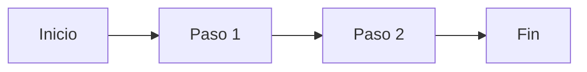

# Cómo agregar fotos, PDFs y videos

Esta página es una guía rápida (bórrala cuando ya no la necesites).

## Fotos

1. Copia la imagen a `public/img/<seccion>/nombre.jpg`.
2. Insértala en cualquier archivo `.md` de `public/content/` con:

```

```

## PDFs (planos, fichas técnicas, manuales de equipos)

1. Copia el PDF a `public/files/<seccion>/nombre.pdf`.
2. Insértalo con un enlace de descarga:

```
[Ver ficha técnica (PDF)](/files/<seccion>/nombre.pdf)
```

## Videos

1. Copia el video a `public/files/<seccion>/nombre.mp4`.
2. Insértalo con HTML dentro del markdown:

```
<video controls width="100%">
  <source src="/files/<seccion>/nombre.mp4" type="video/mp4" />
</video>
```

Si tus videos son grandes o están en YouTube/Drive, es mejor **enlazarlos**
en vez de subirlos al proyecto:

```
[Ver video del procedimiento](https://youtu.be/XXXXXXXXXXX)
```

## Diagramas (Mermaid)

Ya viene activado. Ejemplo de un diagrama de flujo:



## Agregar una página nueva

1. Crea el archivo `.md` dentro de `public/content/<seccion>/`.
2. Agrega la ruta en `src/app/app.routes.ts` (copia una entrada existente).
3. Agrega el enlace en `src/app/shared/manual-nav.data.ts` para que
   aparezca en el menú lateral.
