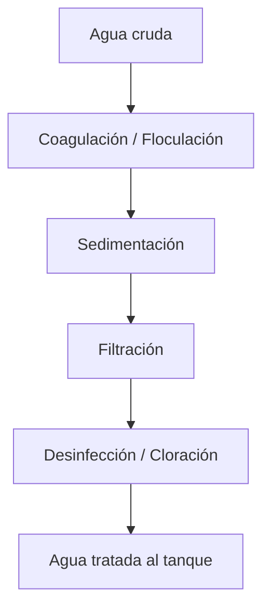

# Planta de potabilización — vista general

> Reemplaza este contenido con la descripción real de tu planta.

## Diagrama del proceso

## Ficha técnica de la planta

| Parámetro | Valor |
|---|---|
| Caudal de diseño | ___ L/s |
| Capacidad de tanques | ___ m³ |
| Tipo de filtración | ___ |
| Método de desinfección | ___ |

## Planos y fotos generales

<!--  -->

Amplía cada etapa (floculación, filtración, desinfección) con los detalles
reales de tu planta.
